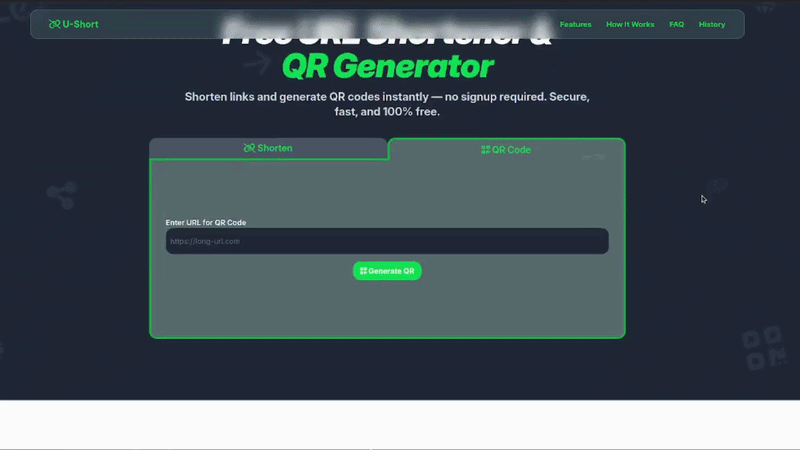

# Hi there 👋

I'm **Rahmat Tomy**  
A **Full-Stack Developer** who enjoys building modern web applications from frontend interfaces to backend APIs.

I have experience working with **JavaScript, React.js, Next.js, and Express.js**, building responsive web applications with full frontend and backend integration. I’m also exploring **Golang for backend development** while learning more about **servers, APIs, and system architecture**.

## About Me

- 💻 Building full-stack web applications
- ⚙️ Interested in **API development and backend systems**
- 🖥️ Exploring **Linux, servers, and deployment**
- 🌱 Currently learning **Golang for backend**
- 🎯 Goal: become a strong **Full-Stack / Backend Engineer**

## Featured Project

<table align="center">
<tr>
<td align="center">

 
<b>Circle App</b> 
Social media platform with realtime updates

</td>

<td align="center">

 
<b>Yellow Store</b> 
E-commerce application with payment integration

</td>

<td align="center">

 
<b>U-Short</b> 
URL shortener built with Golang

</td>
</tr>
</table>

## Tech Stack

### Languages
 
 
 

### Frontend
 
 
 

 

### Backend
 
 

### Database
 

 
 
 

### Tools
 
 
 
 
 
 
 

### Deployment
 
 

## GitHub Stats

  
  

  

## Connect With Me

- LinkedIn → https://www.linkedin.com/in/rahmat-tomy
- Email → rahmattomyapriliyanto@gmail.com
- Portfolio → https://tosrv.github.io

---

⭐ *Always learning and building.*